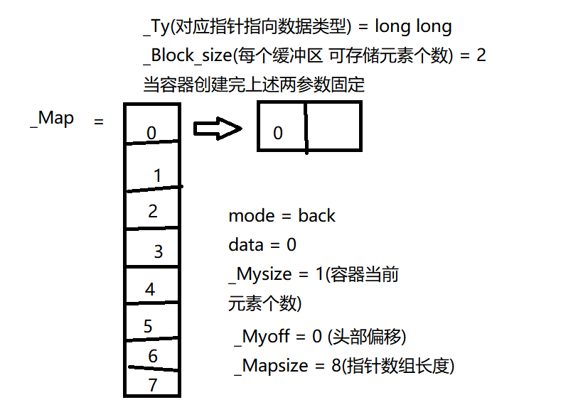
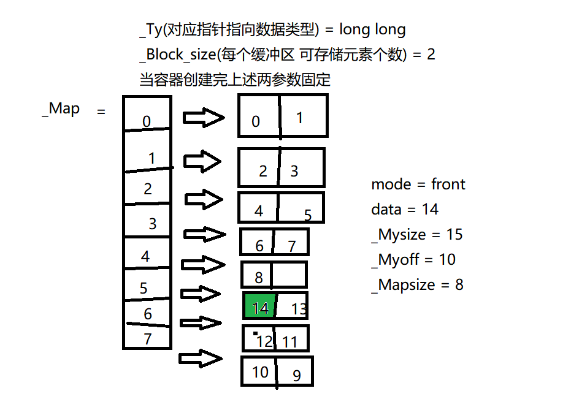
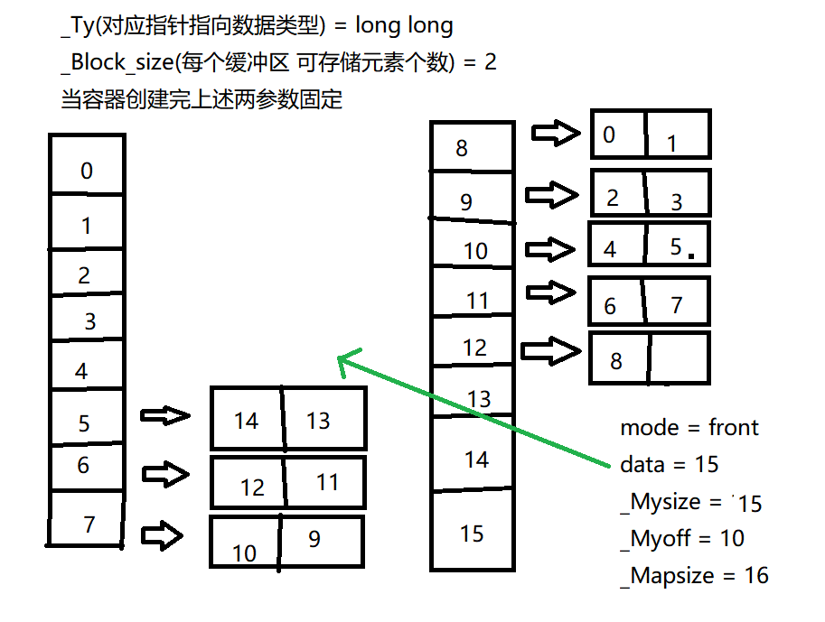
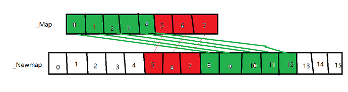
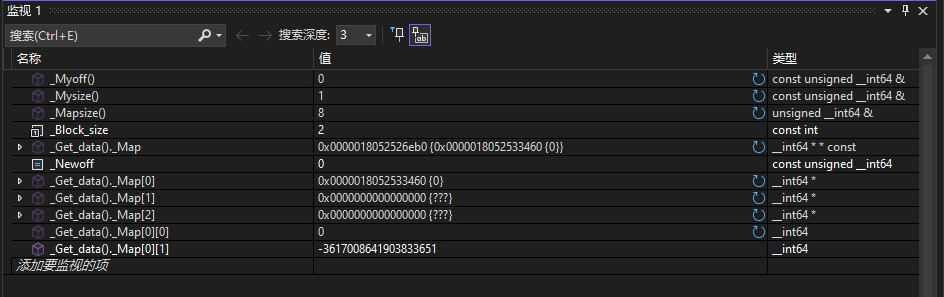
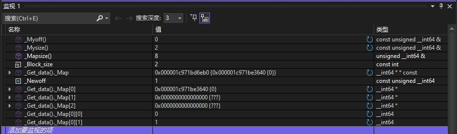
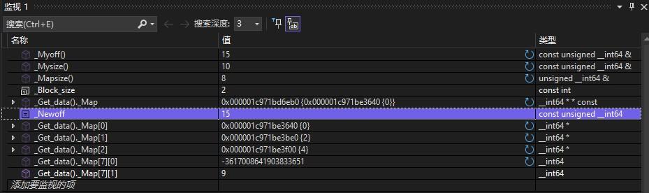
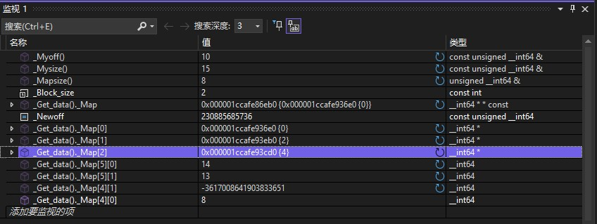
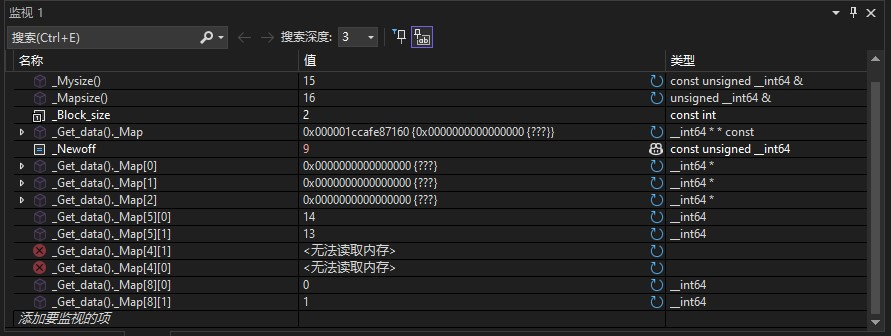

# C++ STL deque 容器

## 一、deque 容器简介

deque（double-ended queue）是 C++ 标准模板库（STL）中的一种序列容器，允许在**两端高效地插入和删除元素**。逻辑结构同vector相同，但是由于物理结构不同，deque 在两端都能提供常数时间的插入和删除操作，而 vector 只能在末尾进行高效操作。

## 二、deque 容器的创建

**deque初始化操作**大致可以分为五中创建方式：

1. 默认构造函数(无参构造)
2. 带初始化列表的构造函数
3. 带大小参数的构造函数
4. 带大小参数和默认值的构造函数
5. 复制构造函数
6. 移动构造函数

```cpp
deque<int> d1;  // 默认构造函数(无参构造)

deque<int> d2({1, 2, 3, 4, 5});  // 带初始化列表的构造函数

deque<int> d3(5);  // 带大小参数的构造函数
deque<int> d4(5, 10);  // 带大小参数和默认值的构造函数

deque<int> d5(d2);  // 复制构造函数
deque<int> d6(std::move(d2));  // 移动构造函数
```

同时值得注意的是，初始化列表、复制、移动构造都可以借助赋值运算符、()、{}来完成。

**deque赋值操作**
相比于初始化，赋值操作可以在容器创建后进行，也可以在容器已经存在的情况下进行。主要借助于赋值运算符、assign() 方法实现赋值操作。

```cpp
deque<int> d1;  // 默认构造函数(无参构造)

d1 = {1, 2, 3, 4, 5};  // 使用赋值运算符(列表)进行赋值
deque<int> d2;
d2 = d1;               // 使用赋值运算符(容器)进行赋值

deque<int> d3;            // 使用 assign() 方法
d3.assign({1, 2, 3, 4});  // 列表
deque<int> d4;
d4.assign(5, 10);         // 大小和默认值
deque<int> d5;
d5.assign(d1.begin(), d1.end());  // 迭代器指定范围
```

## 三、deque 容器大小

对deque容器的大小操作主要包括：

1. size()：返回容器中元素的个数。
2. empty()：判断容器是否为空。
3. resize()：改变容器的大小，若新大小大于当前大小，则用默认值填充新元素；若新大小小于当前大小，则删除多余元素。

```cpp
deque<int> d1({1, 2, 3, 4}); 
cout << "d1 size: " << d1.size() << endl;  // 4
cout << "d1 empty: " << d1.empty() << endl;  // 0

d1.resize(8);
cout << d1.size() << endl;  // 8
```

## 四、deque 容器的插入与删除

对deque容器的插入与删除操作主要包括：

1. push_back()：在容器末尾添加一个元素。
2. pop_back()：删除容器末尾的元素。
3. push_front()：在容器开头添加一个元素。
4. pop_front()：删除容器开头的元素。
5. insert()：在指定位置插入一个或多个元素。
6. erase()：删除指定位置的一个或多个元素。

```cpp
deque<int> d;

d.push_front(11);        // 头插 11
d.push_front(2);         // 头插 2 11
d.push_back(-1);         // 尾插 2 11 -1
d.push_back(12);         // 尾插 2 11 -1 12

d.insert(d.begin() + 1, 999); // 插入位置(迭代器) 插入元素 2 999 11 -1 12
d.insert(d.end() - 1, 3, -6); // 插入位置(迭代器) 个数 元素值
// 2 999 11 -1 -6 -6 -6 12
d.insert(d.begin(), d.begin() + 1, d.begin() + 3);
// 插入元素位置 迭代器片段999 11 -1  2 999 11 -1 -6 -6 -6 12
d.pop_back();    // 尾删 999 11 -1  2 999 11 -1 -6 -6 -6
d.pop_front();   // 头删 11 -1  2 999 11 -1 -6 -6 -6

d.erase(d.begin() + 2);// 删除位置 11 -1 999 11 -1 -6 -6 -6
d.erase(d.begin(), d.begin() + 3); // 删除范围 11 -6 -6 -6
```

## 五、deque 容器的扩容原理

deque 容器的底层实现通常是由**多个固定大小的内存块（称为“缓冲区”或“块”）组成的双向链表**。这种结构使得 deque 能够在两端高效地进行插入和删除操作。
物理上，deque 容器的每个缓冲区都有固定的大小，通常是 512 字节或更大。当 deque 容器需要更多空间时，会动态分配新的缓冲区，并将旧缓冲区中的元素复制到新缓冲区中。
我们分析一下底层代码：
主要有这几个变量(一般下划线开头，表示类中的私有成员变量)

- _Map        = 指向缓冲区的指针数组
- _Mysize     = 容器当前元素的个数
- _Myoff      = 指向第一个元素的偏移量
- _Mapsize    = 缓冲区数组的大小
- _Ty         = 元素类型
- _Block_size = 每个缓冲区的大小

从头开始分析：
当deque初始化的时候，会分配一个缓冲区数组，默认大小为 8。并且元素类型和缓冲区的大小都会固定。



初始状况下指针数组中每个指针指向空，随着不断地插入元素，会**动态为数组的每个指针分配内存(缓冲区)**。例如，我们先插入元素0，这是会分配一块内容，_Map[0] 就会指向这块内存。当然，_Block_size为2，说明每个缓冲区可以存储2个元素。所以第二次插入元素1时，会判断_Map[0]是否已满。如果已满，就会分配新的缓冲区，_Map[1] 就会指向新的内存，如果没有满则继续在_Map[0]指向的内存中继续插入元素。
值得注意的是，当执行尾插操作时，_Myoff（偏移量标记）的值会保持不变；而执行头插操作时，_Myoff会减1。但由于指针数组前方没有可用空间，此时元素会被从后向前插入，_Myoff会直接指向尾部元素的偏移量。
当头部与尾部指针相遇时，说明deque容器已满。需要进行扩容操作



可以观察到，当deque需要扩容时，系统会分配一个新的缓冲区数组，其大小为原数组的两倍。随后，原数组中的所有元素会被复制到这个新数组中。此外，对于那些因指针数组前方空间不足而导致在前插时被后置的元素，扩容过程中也会进行调整——这些原本应该位于后面的元素，会被移动到新缓冲区中的适当位置，以恢复正确的存储顺序。

下面我们通过源码来分析一下扩容过程

```cpp
int main()
{
    deque<long long> d;
    for (int i = 0; i < 18; i++)
    {
        i < 9 ? d.push_back(i) : d.push_front(i);
    }
    return 0;
}
```

```cpp
void _Emplace_back_internal(_Tys&&... _Vals) {
    if ((_Myoff() + _Mysize()) % _Block_size == 0 && _Mapsize() <= (_Mysize() + _Block_size) / _Block_size) {
        _Growmap(1);
    }
    _Myoff() &= _Mapsize() * _Block_size - 1;
    const auto _Newoff = static_cast<size_type>(_Myoff() + _Mysize());
    const auto _Block  = _Getblock(_Newoff);
    if (_Map()[_Block] == nullptr) {
        _Map()[_Block] = _Getal().allocate(_Block_size);
    }

    _Alty_traits::construct(_Getal(), _Get_data()._Address_subscript(_Newoff), _STD forward<_Tys>(_Vals)...);

    ++_Mysize();
}
```

并且进行监视一些变量

插入首个元素后，监视变量显示：_Myoff=0，_Mysize=1，_Mapsize=8。
此时中控器（_Map）初始容量为 8（可存放 8 个缓冲区指针），但仅_Map[0]指向首个分配的缓冲区，其余指针为空（未分配缓冲区）。
因_Block_size=2，该缓冲区可容纳 2 个元素，当前仅存储首个元素，故`_Map[0][0]=0`（第一个元素值），而`_Map[0][1]`未初始化（显示随机值）。

我们再添加一个元素，可以看到_Myoff()值保持不变，_Mysize的值增加1，同时_Map[1]的指针并没有指向内容，而是继续在_Map[0]指向的内存中添加元素。可以看到`_Map[0][0]`=0，而`_Map[0][1]`=1。

当i=9时，我们开始头插，这时候已经插入了9个元素(0-8)，这时候我们再插入元素，会发现指针数组的头部已经没有空间来存放指针。所以只能从后插入元素，这时的偏移量是15(2*8 - 1)，指针数组最后的位置为_Map[7]，并且可以看到是先插入`_Map[7][1]` = 9

当i=15(第16个元素)时，我们再次头插，可以看到此时会触发_Growmap(1)函数，扩容指针数组。我们看目前的变量值，_Mapsize=8，_Mysize=15，_Myoff=10。正好对应`_Map[4][1]`的位置，正好要把当前指针数组所有指针指向的缓冲区填满。
`(_Myoff() % _Block_size == 0 && _Mapsize() <= (_Mysize() + _Block_size) / _Block_size)`
((10 % 2 == 0) && (8 <= (15 + 2) / 2)) == true
当_Growmap(1)函数执行时，会将_Mapsize()增加一倍，变成16。同时，会重新分配一个新的指针数组，指向新的内存地址。对应元素的顺序也会更改

扩容后_Mapsize=16，中控器（_Map）中：_Map[5]之前为新分配的空缓冲区指针，_Map[5]及之后指向原有缓冲区，且_Map[8]之后为原尾插数据。
扩容后中控器会预留前后空闲指针（方便后续头插 / 尾插），故原有缓冲区指针被移至新中控器的中间区域（此处_Map[5]起），前 5 个指针（_Map[0]~_Map[4]）为空（预留头插空间），_Map[8]之后保留原尾插数据的缓冲区指针，确保元素顺序不变。

## 六、deque随机访问

通过vector、string的随机访问，deque也可以通过下标访问元素，在常数时间内直接访问数据结构中的任意元素。

```cpp
// 使用举例
deque<int> d({1, 2, 3, 4, 5, 6});
cout << d[3] << endl; // 4
cout << d.at(3) << endl; // 4
cout << d.front() << endl; // 1
cout << d.back() << endl; // 6
```

```cpp
_Map_difference_type _Getblock(size_type _Off) const noexcept {
    // NB: _Mapsize and _Block_size are guaranteed to be powers of 2
    return static_cast<_Map_difference_type>((_Off / _Block_size) & (_Mapsize - 1));
}

reference _Subscript(size_type _Off) noexcept {
    const auto _Block     = _Getblock(_Off);
    const auto _Block_off = static_cast<difference_type>(_Off % _Block_size);
    return _Map[_Block][_Block_off];
}
```

可以看到主要是通过_Getblock函数计算出元素所在的缓冲区，再通过取余运算得到元素在缓冲区中的偏移量，最后返回该元素。
