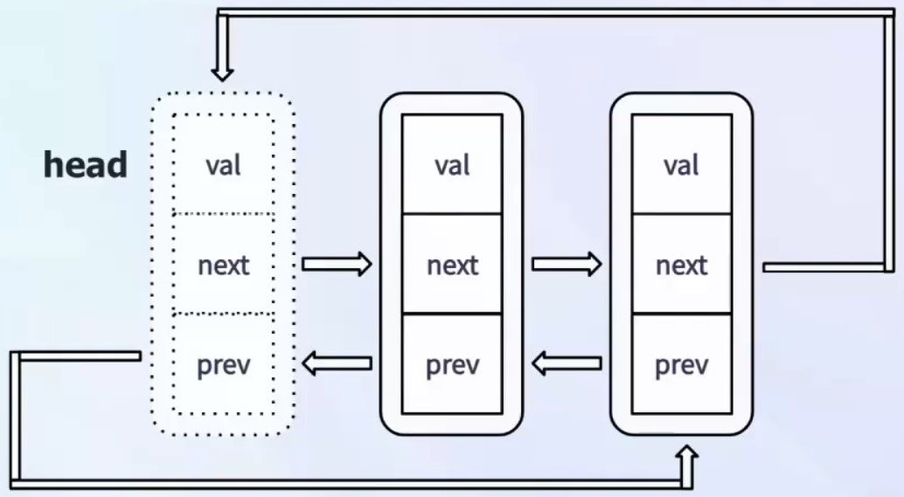

# C++ STL list容器

## 一、list容器基本概念

list是一种**双向链表**bidirectional linked list数据结构，允许在任意位置高效地插入和删除元素。逻辑结构同vector相似，都支持双向操作。与vector不同，list不支持随机访问，但在频繁插入和删除操作时性能更优。list适用于需要频繁修改元素顺序的场景，如任务调度、事件处理等。物理结构上是由节点组成Node(val、next、prev)，值、下一指针、上一指针。
不仅仅是一个链表，它是一个**双向循环链表**，即最后一个节点的next指针指向第一个节点，第一个节点的prev指针指向最后一个节点。


进入list容器的底层实现，可以看到只有一个成员变量_Mypair，它是一个压缩对(compressed pair)，用于存储链表的头节点和尾节点指针。可以看到_Mypair由两个元素组成，分布为_Alnode和_Scary_val。_Alnode是链表节点的类型，_Scary_val是一个_List_val<_Val_types>类型，用于存储链表的大小。可以看到_List_val主要是有两个参数，分别是_Myhead和_Mysize。

- _Myhead：指向链表头节点的指针
- _Mysize：链表的大小，即节点的数量

```cpp
_Compressed_pair<_Alnode, _Scary_val> _Mypair;

using _Scary_val = _List_val<_Val_types>;

//initialize data _list_val构造函数
_List_val() noexcept : _Myhead(), _Mysize(0) {}
```

可以发现的是`_Nodeptr _Myhead`, 即每个节点的类型为_Nodeptr，接下来我们分析一个这个数据类型。

```cpp
template <class _Ty>
struct _List_simple_types : _Simple_types<_Ty> {
    using _Node    = _List_node<_Ty, void*>;
    using _Nodeptr = _Node*;
};
```

_Nodeptr是_List_node<_Ty, void*>类型的指针，而_List_node结构体定义如下：

```cpp
struct _List_node { // list node
    using value_type = _Value_type;
    using _Nodeptr   = _Rebind_pointer_t<_Voidptr, _List_node>;
    _Nodeptr _Next; // 下一个节点指针
    _Nodeptr _Prev; // 上一个节点指针
    _Value_type _Myval = // the stored value, unused if head
}
```

可以看到_List_node结构体中包含了三个成员变量：

- _Next：指向下一个节点的指针
- _Prev：指向上一个节点的指针
- _Myval：存储节点的值
  
## 二、list容器的创建

list容器的创建可以通过多种方式进行，主要包括以下几种：

- 默认构造函数：创建一个空的list容器
- 初始化列表构造函数：使用初始化列表初始化list容器
- 拷贝构造函数、移动构造函数
- 元素数量构造函数：指定数量元素、指定的初始值的list容器
- 范围构造函数：使用迭代器范围初始化list容器

```cpp
list<int> mylist; // 默认构造函数

list<int> mylist2 = {1, 2, 3, 4, 5}; // 初始化列表构造函数

list<int> mylist3(mylist2); // 拷贝构造函数
list<int> mylist4(std::move(mylist2)); // 移动构造函数
list<int> mylist5(5, 10); // 个数
list<int> mylist6(mylist2.begin(), mylist2.end()); // 范围构造函数
```

list容器的赋值操作可以通过多种方式进行，主要包括以下几种：

- 赋值运算符重载：使用赋值运算符将一个list容器赋值给另一个list容器
- 赋值函数：迭代器范围、元素数量、初始化列表赋值

```cpp
list<int> mylist6 = {1, 2, 3, 4, 5}; // 初始化列表构造函数
list<int> mylist7 
mylist7 = mylist6; // 赋值运算符重载

mylist7.assign(mylist5.begin(), mylist5.end()); // 范围赋值函数
mylist7.assign(3, 20); // 元素数量赋值函数
mylist7.assign({100, 200, 300}); // 初始化列表赋值
```

## 三、list容器常用操作

list容器的常用操作包括以下几种：

- 元素访问：front()、back()、operator[]、at()
- 元素插入：insert()、push_front()、push_back()
- 元素删除：erase()、pop_front()、pop_back()
- 容器操作：size()、empty()、clear()、resize()
- 迭代器操作：begin()、end()、rbegin()、rend()
- 排序操作：sort()
- 合并操作：splice()
- 唯一化操作：unique()
- 逆置操作：reverse()

