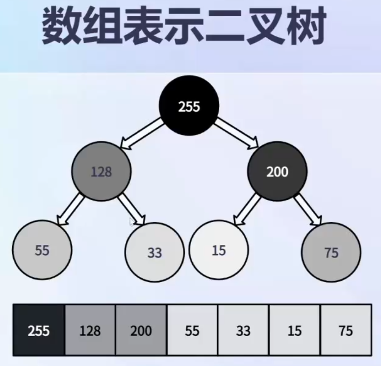
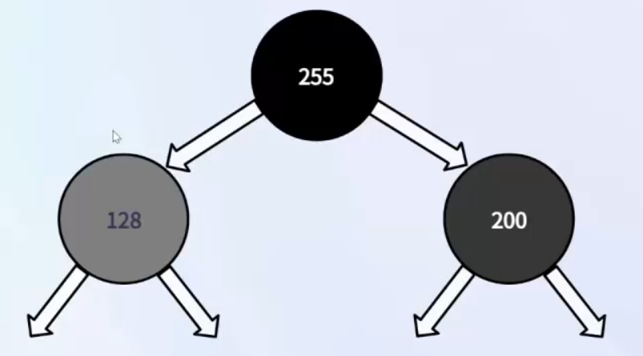
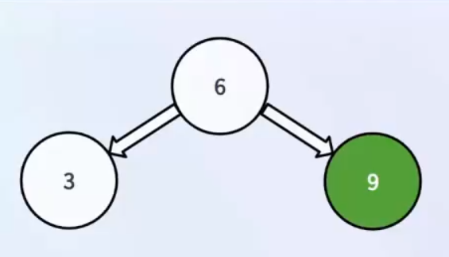
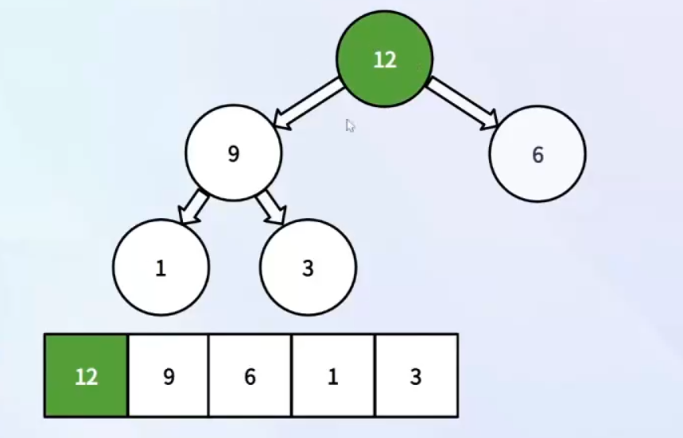
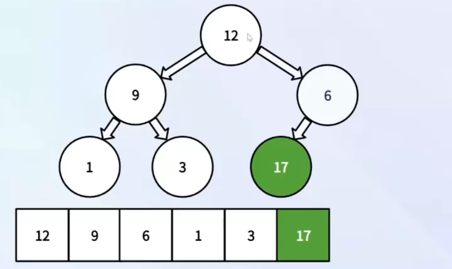
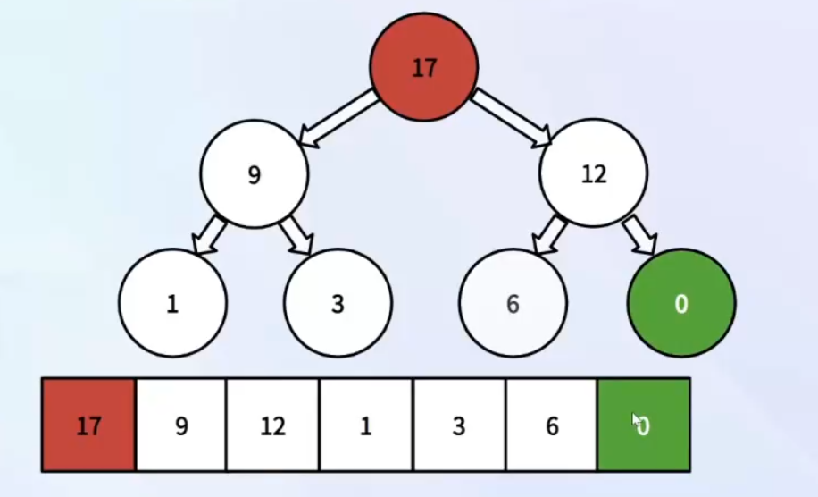
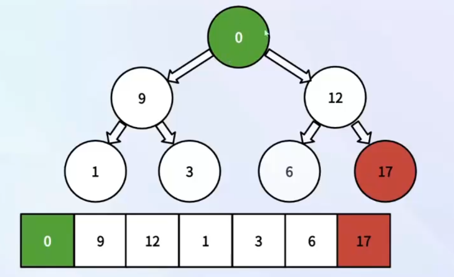
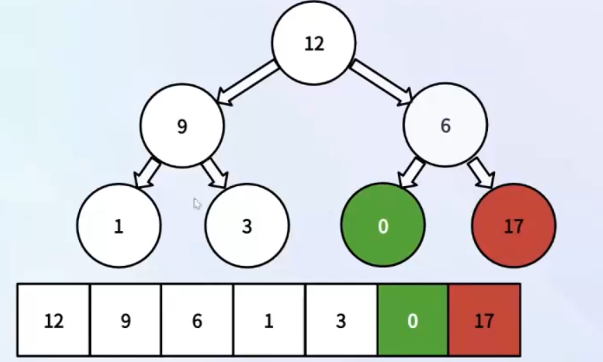
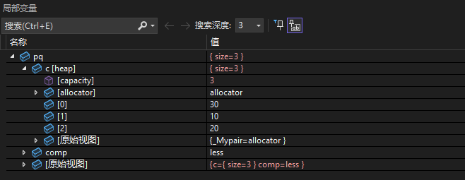

# C++ STL priority_queue 优先队列

## 一、priority_queue的基本概念

priority_queue是一种特殊的容器适配器(线性模拟树)，它提供了优先级队列的功能。优先级队列中的元素按照优先级顺序排列，默认情况下，较大的元素具有较高的优先级。
{width="400" height="400" style="display: block; margin: 0 auto;"}
如图所示，将完全二叉树的元素，按层级从左到右放置到一个数组中。同时我们可以发现一个特点，**父节点的元素值永远大于两个子节点的大小**。因此一个数组就完全可以存储一个完全二叉树的结构。
那么**父子节点下标之间**的关系为：

- 父节点的下标 = (子节点的下标 - 1) / 2
- 左子节点的下标 = 父节点的下标 * 2 + 1 （奇数）
- 右子节点的下标 = 父节点的下标 * 2 + 2 （偶数）

**堆的概念**：
堆是一种特殊的完全二叉树，它的每个节点都大于等于（或小于等于）其子节点。根据节点的大小关系，堆可以分为最大堆和最小堆。

- 最大堆：每个节点都大于等于其子节点，根节点是最大的元素。
- 最小堆：每个节点都小于等于其子节点，根节点是最小的元素。

{width="400" height="200" style="display: block; margin: 0 auto;"}

## 二、priority_queue元素的插入和删除

### 插入元素

{width="400" height="200" style="display: block; margin: 0 auto;"}
插入元素时，将新元素添加到数组的末尾，然后通过**上浮操作**将其移动到正确的位置，以维护堆的性质。
例如图中，在末尾插入9，需要和父节点6进行比较，9大于6，因此9需要上浮到父节点的位置。（两个节点值交换）
{width="400" height="250" style="display: block; margin: 0 auto;"}
同样的操作，我们继续插入元素，例如插入1，1和父节点3比较，1小于3，因此1不需要上浮。再插入12，12和父节点3比较，12大于3，因此12需要上浮到父节点的位置。（两个节点值交换），交换过后，12仍然需要和父节点9比较，12大于9，因此12需要继续上浮到父节点的位置。（两个节点值交换）
{width="400" height="250" style="display: block; margin: 0 auto;"}
可以看到12一直上升到根节点的位置，因此12成为了最大的元素。
同样的操作，我们继续插入元素，例如插入17，17和父节点6比较，17大于6，因此17需要上浮到父节点的位置。（两个节点值交换），交换过后，17仍然需要和父节点12比较，17大于12，因此17需要继续上浮到父节点的位置。（两个节点值交换），可以看到17一直上升到根节点的位置，因此17成为了最大的元素。
{width="400" height="250" style="display: block; margin: 0 auto;"}

我们需要注意的是，插入元素时，**树并不是真是存在的，只是逻辑上理解，树的结构是通过层级将元素存储到数组中**。每次往数组尾部插入一个元素，会对插入元素比较它在树形结构中和它的父节点的大小关系，来决定是否和父节点进行交换。

### 获取堆顶元素

堆顶元素是指优先级最高的元素（数组第0个元素），即最大堆中的最大元素或最小堆中的最小元素。时间复杂度为O(1)。
可以通过访问数组的第一个元素来获取堆顶元素。
例如，最大堆中的堆顶元素是数组的最大值，最小堆中的堆顶元素是数组的最小值。

### 删除堆顶元素

删除元素就是删除数组的第一个元素，即堆顶元素。然而并不是直接删除堆顶元素，如果直接删除，会使得左右子树的结构被破坏，因此我们需要将数组的最后一个元素移动到堆顶，然后通过**下沉**操作将其移动到正确的位置，以维护堆的性质。

{width="400" height="250" style="display: block; margin: 0 auto;"}
如图所示，我们先选取数组的最后一个元素0，将其和堆顶元素进行交换。
{width="400" height="250" style="display: block; margin: 0 auto;"}
可以看到交换后，0处于堆顶位置，但是0的左右子树的结构被破坏了，因此我们需要通过下沉操作将0移动到正确的位置，以维护堆的性质。
可以看到0均均小于左右子树(9,12), 选取左右子树中更大的元素与父节点0进行交换，即交换12和0。接下来继续判断0是否小于其左右子树的元素，发现0小于左右子树(6,17),但是17作为原始的根节点是要删除的，因此0只能和6进行交换。
{width="400" height="250" style="display: block; margin: 0 auto;"}
完成交换后，删除数组的最后一个元素17，即可完成删除操作。

那么最后总结一下，元素的删除

1. 把数组第0个元素和最后一个元素进行交换
2. 然后对堆顶的元素不断地做下沉操作，选择左右子树中的大的进行交换，直到自己变成大于左右子树的元素，或者自己没有子树了。
3. 删除数组的最后一个元素
4. 元素的删除就是优先队列的出队(pop)操作

### 容器的特点区别

- 线性容器：vector、string、list、deque、queue
- 树形容器: set, multiset, map, multimap
- 线性模拟树：priority_queue

## 三、priority_queue 创建

priority_queue的模版参数为`template <class _Ty, class _Container = vector<_Ty>, class _Pr = less<typename _Container::value_type>>`，含义分别为：

- _Ty：元素类型
- _Container：底层容器类型，默认是vector
- _Pr：比较函数对象，默认是less，即最大堆，也可以是greater，即最小堆

所以我们可以根据需要，选择不同的比较函数对象，来创建最大堆或最小堆。

```cpp
priority_queue<int> maxHeap; // 默认是最大堆
priority_queue<int, vector<int>, greater<int>> minHeap; // 最小堆
```

## 四、priority_queue 堆顶元素与队尾插入

获取堆顶元素主要借助于top函数，时间复杂度为O(1)。

```cpp
_NODISCARD const_reference top() const noexcept(noexcept(c.front())) /* strengthened */ {
    return c.front();
}
```

可以看到主要是通过调用容器的front函数来获取vector的第一个元素，即堆顶元素。
插入元素借助于push函数，时间复杂度为O(logn)。

```cpp
priority_queue<int> pq; // 最大优先队列
pq.push(10);
pq.push(30);
pq.push(20);
cout << pq.top() << endl; // 30
pq.push(40);
cout << pq.top() << endl; // 40
```

下一个断点，一步一步执行查看效果

观察过程中的变量，pq即为创建的优先队列，包含两个局部变量，分别是容器和比较函数对象。
容器采用的是vector，可以看到对应capacity为3，同时可以看到对应各个位置的元素值为30，10，20。即随着元素的插入会进行判断，将优先级更高的元素上浮到最顶端。同时因为先插入的10，然后插入30，20，因此30成为了最大的元素，10成为了左端元素，20成为了右端元素。

## 五、priority_queue 出队与大小

出队操作主要借助于pop函数，时间复杂度为O(logn)。

```cpp
priority_queue<int> pq; // 最大优先队列
pq.push(10);
pq.push(30);
pq.push(20);
cout << pq.top() << endl; // 30
pq.pop();
cout << pq.top() << endl; // 20
```

```cpp
void pop() {
    _STD pop_heap(c.begin(), c.end(), _STD _Pass_fn(comp));
    c.pop_back();
}
```

查看源码，pop主要是调用了容器的pop_heap函数，将堆顶元素和最后一个元素进行交换,进行不断的下沉操作，然后删除最后一个元素(pop_back)。

同时我们也可以通过size函数来获取优先队列的大小，通过empty函数来判断优先队列是否为空，时间复杂度均为O(1)。即调用容器的size函数和empty函数。

```cpp
cout << pq.size() << endl; // 3
cout << pq.empty() << endl; // 0 
```

## 六、自定义类型

我们也可以自定义类型，然后通过重载比较函数对象，来实现优先队列的功能。

```cpp
struct Student{
    int id;
    int age;
    string name;
    Student(int i, int a, string n) : id(i), age(a), name(n) {}
    Student() : id(0), age(15), name("张三"){}
}
```

当插入自定义类型时，需要两个参数进行比较，需要重载比较函数对象。

```cpp
bool operator<(const Student& s) const {
    return this->age > s.age; // 按年龄降序排序
}
```
