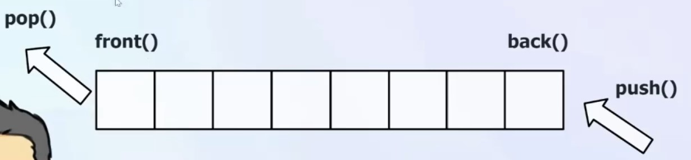

# C++ queue容器

## 一、queue 容器简介

队列（queue）是一种**先进先出（FIFO）的数据结构**，允许在一端进行插入操作（入队），在另一端进行删除操作（出队）。C++ STL 提供了 queue 容器适用于需要按顺序处理元素的场景，如任务调度、消息传递等。


可以看到的是，只可以对队列的队头和队尾进行操作，不可以对队列的其他元素进行操作。随着不断的**插入**，可以发现队头元素不会发生改变，只有队尾元素会发生改变。而随着不断地**出队**操作，队尾元素不会发生改变，队头元素会不断地往后移动。

- 队头：获取元素(front)、删除元素(pop)
- 队尾：获取元素(back)、插入元素(push)

## 二、queue 容器的创建

**queue初始化操作**
模版参数`template <class _Ty, class _Container = deque<_Ty>>`含义分别为：

- `_Ty`：队列中元素的类型。
- `_Container`：底层容器类型，默认使用 `deque<_Ty>`双端队列。

创建queue容器的方式与stack容器类似，主要有以下四种方式：

1. 默认构造函数(无参构造)
2. 带初始化列表的构造函数
3. 复制构造函数
4. 移动构造函数

```cpp
queue<int> q1;  // 默认构造函数(无参构造)
queue<int, vector<int>> q5;  // 自定义容器类型为 vector<int>

queue<int> q2 = {1, 2, 3, 4, 5};    //列表
queue<int> q3(q2);           // 复制构造函数
queue<int> q4 = std::move(q3);// 移动构造函数
```

我们进入queue的底层实现，可以看到`queue() = default;`，说明queue无参构造函数采用的是默认构造函数，采用每个成员变量复制。而queue只有一个成员变量，即底层容器`_Container c{};`。因此无参构造函数采用的是底层容器的默认构造函数。
**queue赋值操作**
主要借助于赋值运算符方法实现赋值操作。

```cpp
queue<int> q1 = {1, 2, 3, 4, 5};  
queue<int> q2;
q2 = q1;// 使用赋值运算符(容器)进行赋值
```

同样看底层代码可以发现，queue并没有运算符重载，说明queue采用的是默认的赋值操作，即逐个元素赋值。默认的底层容器为deque，我们进入deque的底层实现，搜索`operator=`，可以看到deque有好几个赋值运算符的实现，分别对应不同的赋值场景。例如输入deque对象，输入列表等。

## 三、queue容器队列操作

- **判空操作**主要借助于`empty()`方法实现，指示队列是否为空。
- **获取队列大小**主要借助于`size()`方法实现，返回队列中元素的个数。
- **获取队头元素**主要借助于`front()`方法实现，返回队头元素的引用。
- **获取队尾元素**主要借助于`back()`方法实现，返回队尾元素的引用。
- **入队操作**主要借助于`push()`方法实现，该方法将元素插入到队尾。
- **出队操作**主要借助于`pop()`方法实现，该方法将队头元素删除。

```cpp
_NODISCARD_EMPTY_MEMBER_NO_CLEAR bool empty() const noexcept(noexcept(c.empty())) /* strengthened */ {
    return c.empty();
}
_NODISCARD size_type size() const noexcept(noexcept(c.size())) /* strengthened */ {
    return c.size();
}
_NODISCARD reference front() noexcept(noexcept(c.front())) /* strengthened */ {
    return c.front();
}
_NODISCARD const_reference front() const noexcept(noexcept(c.front())) /* strengthened */ {
    return c.front();
}
_NODISCARD reference back() noexcept(noexcept(c.back())) /* strengthened */ {
    return c.back();
}
_NODISCARD const_reference back() const noexcept(noexcept(c.back())) /* strengthened */ {
    return c.back();
}
void push(const value_type& _Val) {
    c.push_back(_Val);
}
void push(value_type&& _Val) {
    c.push_back(_STD move(_Val));
}
void pop() noexcept(noexcept(c.pop_front())) /* strengthened */ {
    c.pop_front();
}
```

我们分析以上代码实现，**发现queue容器的各项操作主要借助于底层容器的方法实现**。例如判空操作主要借助于底层容器的`empty()`方法实现，获取队列大小主要借助于底层容器的`size()`方法实现，获取队头元素主要借助于底层容器的`front()`方法实现，获取队尾元素主要借助于底层容器的`back()`方法实现，入队操作主要借助于底层容器的`push_back()`方法实现，出队操作主要借助于底层容器的`pop_front()`方法实现。
