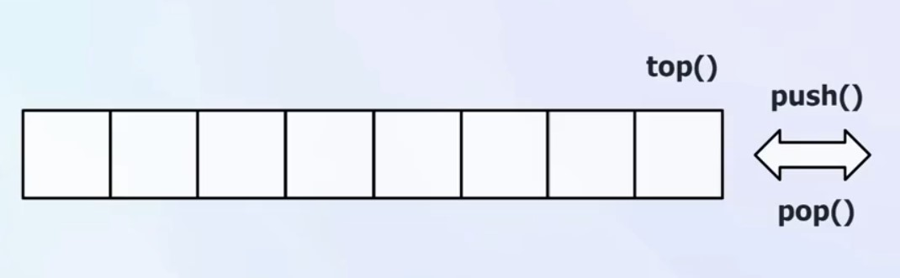

# C++ STL stack 容器

## 一、stack 容器简介

数据结构中栈的实现，遵循后进先出（LIFO）的原则。栈只允许在栈顶进行插入(push)和删除(pop)操作，这使得栈在很多场景中非常有用，例如表达式求值、括号匹配、函数调用等。



## 二、stack 容器的创建

**stack初始化操作**
模版参数`template <class _Ty, class _Container = deque<_Ty>>`含义分别为：

- `_Ty`：栈中元素的类型。
- `_Container`：底层容器类型，默认使用 `deque<_Ty>`双端队列。

容器的创建大致可以分为四种创建方式：

1. 默认构造函数(无参构造)
2. 带初始化列表的构造函数
3. 复制构造函数
4. 移动构造函数

```cpp
stack<int> s1;  // 默认构造函数(无参构造)
stack<int, vector<int>> s5;  // 自定义容器类型为 vector<int>

stack<int> s2 = {1, 2, 3, 4, 5};    //列表
stack<int> s3(s2);           // 复制构造函数
stack<int> s4 = std::move(s3);// 移动构造函数
```

**stack赋值操作**
主要借助于赋值运算符方法实现赋值操作。

```cpp
stack<int> s1 = {1, 2, 3, 4, 5};  
stack<int> s2;
s2 = s1;// 使用赋值运算符(容器)进行赋值
```

我们进入stack的底层实现，搜索`operator=`，但是并没有找到赋值运算符的实现。说明stack采用的是默认的赋值操作，即逐个元素赋值。通过查找可以发现stack只有一个成员变量`_Container c{};`，即底层容器。
默认的底层容器为deque，我们进入deque的底层实现，搜索`operator=`，可以看到deque有好几个赋值运算符的实现，分别对应不同的赋值场景。例如输入deque对象，输入列表等。

## 三、stack容器栈顶操作

**入栈操作**主要借助于`push()`方法实现，该方法将元素压入栈顶。

```cpp
stack<int> s;
s.push(1);      // 1
s.push(2);      // 2 1
s.push(3);      // 3 2 1   
```

实现方法（左值引用、右值引用）：

```cpp
void push(const value_type& _Val) {
    c.push_back(_Val);
}

void push(value_type&& _Val) {
    c.push_back(_STD move(_Val));
}
```

**获取栈顶元素**主要借助于`top()`方法实现，该方法返回栈顶元素的引用。

```cpp
stack<int> s;
s.push(1);
s.push(2);
s.push(3);

int top = s.top();  // top = 3
```

同样我们进入源码查看`top()`方法的实现，发现是直接返回底层容器的最后一个元素的引用。

```cpp
NODISCARD reference top() noexcept(noexcept(c.back())) /* strengthened */ {
        return c.back();
}
```

**出栈操作**主要借助于`pop()`方法实现，该方法将栈顶元素弹出。

```cpp
stack<int> s;
s.push(1);
s.push(2);
s.push(3);      // 3 2 1

s.pop();        // 2 1
```

同样进入源码实现，发现是直接调用底层容器的`pop_back()`方法。

```cpp
void pop() noexcept(noexcept(c.pop_back())) /* strengthened */ {
    c.pop_back();
}
```

## 四、stack容器大小和替换操作

**获取栈大小**主要借助于`size()`方法实现，该方法返回栈中元素的数量。
**判断栈是否为空**主要借助于`empty()`方法实现，该方法返回一个布尔值，若栈为空则返回true，否则返回false。

```cpp
stack<int> s = {1, 2, 3, 4, 5};

int size = s.size();  // size = 5
bool isEmpty = s.empty();  // isEmpty = false
```

栈在创建时，默认容器是deque，同时呢我们可以通过指定别的容器来创建stack容器，例如vector、list等。
`stack<int, vector<int>> s5;`
那么在获取栈大小和判断栈是否为空时，底层调用的就是vector的`size()`和`empty()`方法。
