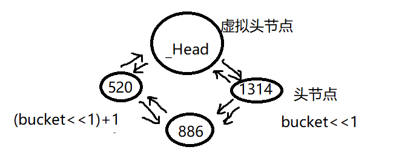
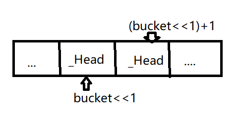
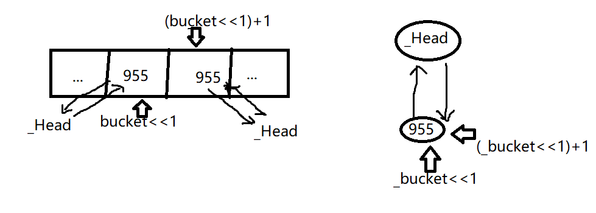
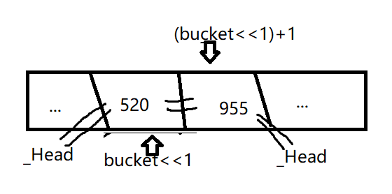

# C++ STL unordered_set 容器

## unordered_set 容器基本概念

除了C++的STL，python、lua、Readis底层都有哈希表的实现，大体的实现逻辑都差不多的，但是在解决哈希冲突的时候会有略微差别。在增删改查上相对于vecotr(O(n))、链表(O(logn))都有不错的效率(O(1))。

哈希键(任意类型) -> 哈希函数 -> 取模\位与 -> 下标索引(桶ID)

哈希冲突：**两种键值**通过运算得到的**桶ID**是相同的。
解决方法：一个桶中存放多个元素，利用链表把桶中的所有元素串联起来，(bucket>>1)作为链表起点，(bucker>>1)+1作为链表的终点，值得注意的是链表使用的是循环双向链表，所以必然有一个虚拟头节点。



如果该桶中没有任何的元素，那么(bucket>>1)和(bucket>>1)+1存储的是虚拟头节点_Head.

当插入元素(995)时，

因为只有一个元素，所以链表的首尾都是该元素，即(bucket<<1)和(bucket<<1)+1都指向该元素

再插入元素520，会先对链表中的元素进行遍历，看是否含有520，如果不含有则采用头插法插入到链表中，因此(bucket<<1)指向520

那么删除和查找就很明确了，采用从链表尾部进行遍历的方法，如果没找到的话返回虚拟头节点_Head。

## unordered_set 容器的创建

创建方法主要分为

- 默认构造函数
- 初始化列表
- 迭代器拷贝
- 拷贝构造函数
需要注意的是，无论是初始化列表还是利用拷贝，得到的容器中元素的顺序既不会按照复制的顺序也不会按照元素大小的顺序，是无序的。
```cpp
unordered_set<int> us1; // 默认构造函数

// 初始化列表  存储是无序的
unordered_set<int> us2 = {1, 2, 23, 34, 2, 1};
unordered_set<int> us3({12, 12, 23, 23, 1, 2});

// 迭代器
unordered_set<int> us4(us2.begin(), us.end());

// 拷贝构造
unorderd_set<int> us5(us4);
```

**赋值操作** 
同样赋值操作得到的unordered_set也是无序的，主要借助于两种方式实现赋值操作：

- 赋值运算符
- 初始化列表

```cpp
unordered_set<int> us = {12, 1, 23, 111, 234, 3, 54};
unordered_set<int> us1,us2;

us1 = us;
us2 = {12, 22, 11, 23};
``` 

## unordered_set 容器大小插入操作
**大小操作**主要借助于size()和empty()，分别求元素数量和判空
**插入操作**主要借助于insert()函数，当然插入后容器的顺序也是随机的

```cpp
unordered_set<int> us = {1, 2, 3, 1, 2, 11, 222};
cout << us.size() << endl;
cout << us.empty() << endl;

us.insert(12);
us.insert(23);
vector<int> v = {12, 2, 1, 22};
us.insert(v.begin(), v.end());
```

由于unordered_set每个元素只有一个值，也就是不像map那样有键值对的概念，但是由于是存储到hash这种数据类型中，所以插入的元素必须承担键值和值的概念。

- 作为 “数据” 被存储（即用户需要保存的内容）；
- 作为 “键” 用于计算哈希值（确定存储的桶位置）和检查唯一性（通过 == 比较，避免重复插入）。

```cpp
else if constexpr (_In_place_key_extractor::_Extractable) {
    const auto& _Keyval = _In_place_key_extractor::_Extract(_Vals...);// 获取键值
    const auto _Hashval = _Traitsobj(_Keyval);// 获取哈希值
    auto _Target        = _Find_last(_Keyval, _Hashval); // 查找是否含有该键值
    if (_Target._Duplicate) {
        return {_List._Make_iter(_Target._Duplicate), false};
    }

    _Check_max_size();
    // invalidates _Keyval:
    _List_node_emplace_op2<_Alnode> _Newnode(_List._Getal(), _STD forward<_Valtys>(_Vals)...);
    if (_Check_rehash_required_1()) {
        _Rehash_for_1();
        _Target = _Find_last(_Traits::_Kfn(_Newnode._Ptr->_Myval), _Hashval);
    }

    return {
        _List._Make_iter(_Insert_new_node_before(_Hashval, _Target._Insert_before, _Newnode._Release())), true};
    }// 插入新的元素 并返回
```

## unordered_set 容器的查找

unordered_set的**数据查找**, 使用find函数 返回迭代器
```cpp
unordered_set<int> us = {12, 1, 23, 54, 323, 1};

if (us.find(12) != us.end())
    cout << "find 12!" << endl;
else
    cout << "no find" << endl;
```

进入源码分析一下

```cpp
if constexpr (_Traits::_Multi) {
    return _Find_first(_Keyval, _Hashval);
} else {
    // use _Find_last for unique containers to avoid increase in code size of instantiating _Find_first
    auto _Target = _Find_last(_Keyval, _Hashval)._Duplicate;
    if (_Target) {
        return _Target;
    }

    return _List._Mypair._Myval2._Myhead;
}
```

对于unordered_multiset版本则对应`_Traits::_Multi`版本
对于unordered_set则对应else的情况，可以看到会调用`_Find_last`方法，如果找到的话会返回这个节点对应的迭代器，如果没有找到的话会返回链表的头节点（接就是虚拟节点），那么我们分析一下这个函数

```cpp
_NODISCARD _Hash_find_last_result<_Nodeptr> _Find_last(const _Keyty& _Keyval, const size_t _Hashval) const {
    // find the insertion point for _Keyval and whether an element identical to _Keyval is already in the container
    const size_type _Bucket = _Hashval & _Mask; // 取模运算
    _Nodeptr _Where         = _Vec._Mypair._Myval2._Myfirst[(_Bucket << 1) + 1]._Ptr;
    const _Nodeptr _End     = _List._Mypair._Myval2._Myhead;
    if (_Where == _End) {
        return {_End, _Nodeptr{}};
    }

    const _Nodeptr _Bucket_lo = _Vec._Mypair._Myval2._Myfirst[_Bucket << 1]._Ptr;
    for (;;) {
        // Search backwards to maintain sorted [_Bucket_lo, _Bucket_hi] when !_Standard
        if (!_Traitsobj(_Keyval, _Traits::_Kfn(_Where->_Myval))) {
            if constexpr (!_Traits::_Standard) {
                if (_Traitsobj(_Traits::_Kfn(_Where->_Myval), _Keyval)) {
                    return {_Where->_Next, _Nodeptr{}};
                }
            }

            return {_Where->_Next, _Where};
        }

        if (_Where == _Bucket_lo) {
            return {_Where, _Nodeptr{}};
        }

        _Where = _Where->_Prev;
    }
}
```

可以看到会先进行取模运算求得键值对应的桶id，然会求得到对应的头尾节点的地址，会和虚拟节点进行对比，如果相等（没有元素）直接返回空。如果不为空则进入循环了，从尾部开始，会一直进行元素的比较，如果相等则返回{下一个节点， 节点}。同时会让节点一直向前，当节点等于手节点的时候循环结束，也就是返回的第二个值是对应的节点的迭代器。

## unordered_set 容器的删除

删除操作主要借助于erase函数
```cpp
unordered_set<int> us = {1, 23, 33, 22, 12, 15};
us.erase(1);
for (unordered_set<int>::const_iterator it = us.begin(); it != it.end(); it++)
{
    cout << *it << " ";
}cout << endl;

// 同时可以借助查找迭代器进行删除
unordered_set<int>::const_iterator its = us.find(23);
us.erase(its);

// 同时可以删除一段元素 由于元素随机 删除区间也随机 不建议使用
us.erase(us.find(22), us.find(33));

// 全部删除
us.clear();
```

同时我们看一下源码实现：

```cpp 
const auto _Target = _Find_last(_Keyval, _Hashval)._Duplicate;
if (_Target) {
    _Erase_bucket(_Target, _Hashval & _Mask);
    _List._Unchecked_erase(_Target);
    return 1;
}
```
`_Erase_bucket`主要处理的是要删除的值再头尾节点的情况
`_List._Unchecked_erase(_Target)`是具体实现删除节点的操作

```cpp
_Nodeptr _Unchecked_erase(const _Nodeptr _Pnode) noexcept { // erase element at _Pnode
    const auto _Result = _Pnode->_Next;
    _Mypair._Myval2._Orphan_ptr2(_Pnode);
    --_Mypair._Myval2._Mysize;
    _Pnode->_Prev->_Next = _Result;
    _Result->_Prev       = _Pnode->_Prev;
    _Node::_Freenode(_Getal(), _Pnode);
    return _Result;
}
```

主要是对要删除节点的上一个节点和下一个节点进行操作，最后返回下一个节点的迭代器

## unordered_set 容器的统计

```cpp
unordered_set<int> us = {12, 2, 34, 23, 12, 22, 11};
cout << us.count(12) << endl; // 只会是0或1

unordered_multiset<int> ums = {1223, 1, 1, 2, 2, 3, 1};
cout << ums.count(1) << endl;
```