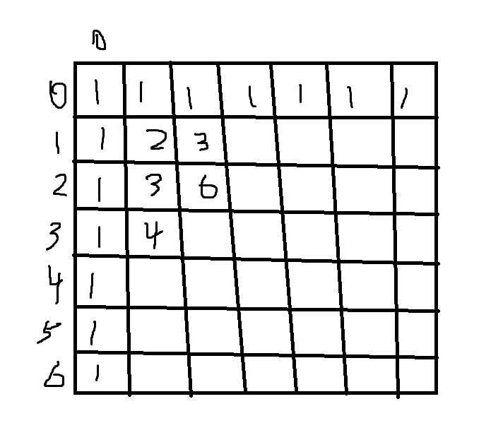
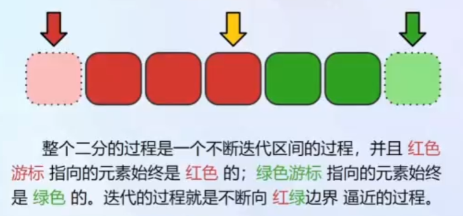
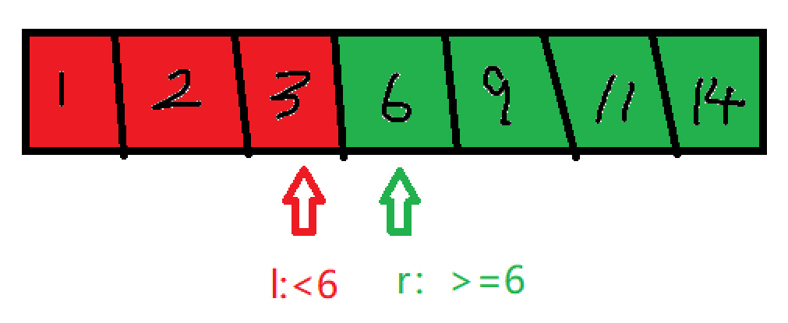

# Algorithm

## 线性枚举

线性查找(线性枚举)：就是从头开始遍历元素，挨个进行比较。简单有效，用于开拓思路，但效率低下，时间复杂度为O(nm)。n对应线性表的长度，m对应每次操作所需要操作的量级。

常见的应用场景：求最大值/最小值、求和、求平均值、判断是否存在某个值等。

```cpp
function getMax(arr_num, arr) // 求最大值
{
    max_val = -inf;
    for i -> [0, arr_num-1]
    {
        if arr[i] > max_val
            max_val = arr[i];
    }
    return max_val;
}
function getSum(arr_num, arr)   // 求和
{
    sum_val = 0;
    for i -> [0, arr_num-1]
    {
        sum_val += arr[i];
    }
    return sum_val;
}
```

## 模拟

模拟算法没有特定的算法框架，就是根据问题需要，逐步实现题目要求的功能。通常用于实现题目中描述的过程，或者直接按照题目要求进行操作。
模拟题重要的是选择合适的数据结构，然后根据问题来实现相应的功能，常见的数据结构有：数组、字符串、矩阵、二叉树、链表等。

示例：
给定一个非负整数 num，反复将**各个位上的数字相加**，直到**结果为一位数**。返回这个结果。
如输入: num = 38，输出: 2 
解释: 各位相加的过程为：

- 38 --> 3 + 8 --> 11
- 11 --> 1 + 1 --> 2

由于 2 是一位数，所以返回 2。
 
```cpp
int addDigits(int num) {
    while(num >= 10)  // 一个循环直到num为一位数
    {
        int sum = 0;  // 实现将num = 各个位数相加
        while(num)
        {
            sum += num%10;
            num = num/10;
        }
        num = sum;
    }
    return num;     // 满足条件的话即可返回
}
```

## 递推

递推是动态规划的基础，递推是通过已知的初始条件和递推关系，逐步计算出后续的结果。递推通常用于解决具有重叠子问题和最优子结构性质的问题。最通俗的理解就是数列，递推和数列的关系就如同算法和数据结构，数列如线性表，而递推就是一个循环或者迭代的枚举过程。
接下来列举几个经典的递归问题：

### 斐波那契数列
该数列前两项为0和1，后续每一项为前两项之和，即$F(0)=0, F(1)=1, F(n)=F(n-1)+F(n-2) (n>=2)$。
由于斐波那契数列的增长速度很快(指数级别的增长)，所以再实际使用的时候，一般不会超过30项，int类型存储范围有限。那么我们可以使用cpp来实现一下数列的递推过程。

```cpp
int fibonacci[31] = {0, 1}; // 定义数组

for (int i = 2; i<=30; i++)
{
    fibonacci[i] = fibonacci[i-1] + fibonacci[i-2]; // 递推关系
}
```

### 泰波那契数列

该数列前3项为0,1,1，后续每一项为前三项之和，即$T(0)=0, T(1)=1, T(2)=1, T(n)=T(n-1)+T(n-2)+T(n-3) (n>=3)$。

```cpp
int tribonacci[31] = {0, 1, 1}; // 定义数组
for (int i = 3; i<=30; i++)
{
    tribonacci[i] = tribonacci[i-1] + tribonacci[i-2] + tribonacci[i-3]; // 递推关系
}
```

### 基于斐波那契数列的变种问题

给定一个45节台阶的楼梯，一开始再第0阶，每次可以向上爬1阶或者2阶，问有多少种不同的方式可以爬到第45阶？

**分析一下**：由于每次只能爬1阶或者2阶，那么到达第n阶的方法数等于到达到达第n-1阶和第n-2阶的方法之和。
初始条件为$f(0)=1,f(1)=1$，按此递推即可得到f(45)的值。

### 二维递推问题

像斐波那契数列这种一维递推问题比较简单，有时候一维解决不了，这时候我们需要升高一个维度来看问题。

给定一个m行n列的网格，起始位置在左上角(0,0)，目标位置在右下角(m-1,n-1)，每次只能向下或者向右移动一步，问有多少种不同的路径可以到达目标位置？

**分析一下**：到达位置(i,j)的方法数等于到达位置(i-1,j)和(i,j-1)的方法数之和。
初始条件为f(0,0)=1，第一行和第一列的位置只能通过一种方式到达(一直向右或者一直向下)因此为1，只要将数据存储至二维数组上，该问题按此递推即可得到f(m-1,n-1)的值。

```cpp
// 假如m = 10， n = 10
int grid[10][10] = {0};
for (int i = 0; i < m; i++) grid[i][0] = 1; // 第一列置0
for (int j = 0; j < n; j++) grid[0][j] = 1; // 第一行置0

for (int i = 1; i < 10; i++)
{
    for (int j = 1; j < 10; j++)
    {
        grid[i][j] = grid[i-1][j] + grid[i][j-1]; // 递推关系
    }
}
return grid[9][9];
```

长度为n(1<=n<=40)的只由'A'、'C'、'M'三种字符组成的字符串，禁止出现'M'字符相邻的情况，问这样的串有多少种？

**分析一下**：以'A'字符结尾的为$f[n][0]$种，以'C'字符结尾的为$f[n][1]$种，以'M'字符结尾的为$f[n][2]$种。则共有$f[n][0]+f[n][1]+f[n][2]$种。
则长度为n的字符方法可以由长度为n-1的字符方法求得
$$
f[n][0] = f[n-1][0] + f[n-1][1] + f[n-1][2]\\
f[n][1] = f[n-1][0] + f[n-1][1] + f[n-1][2]\\
f[n][2] = f[n-1][0] + f[n-1][1]（不能连续出现'M'）
$$
进行统分
$$
f[n][0] = f[n][1] = \sum_{i=0}^2 f[n-1][i] \\
f[n][2] = f[n-1][0] + f[n-1][1] = 2\sum_{i=0}^2 f[n-2][i]
$$
因此$f[n] = f[n][0] + f[n][1] + f[n][2]$ 可以表示为
$$
f[n] = \sum_{i=0}^2 f[n][i] = 2\sum_{i=0}^2 f[n-1][i] + 2\sum_{i=0}^2 f[n-2][i]
$$
为了简化表示
$$
令 g[n] = \sum_{i=0}^2 f[n][i]
$$
因此$g[n] = 2g[n-1] + 2g[n-2]$

我们再想一下初始条件（手算出长度为1，2的方案数）:
$$
f[1][0] = 1, f[1][1] = 1, f[1][2] = 1;\\
g[1] = \sum_{i=0}^2 f[1][i] = 3;\\
g[2] = \sum_{i=0}^2 f[2][i]\\
     = f[2][0] + f[2][1] + f[2][2]
     = 3 + 3 + 2 = 8
$$

因此可以写下如下的程序：

```cpp
int g[41] = {0};
g[1] = 3, g[2] = 8;
for (int i = 3; i<41; i++)
{
    g[i] = 2*g[i-1] + 2*g[i-2];
}
return g[40];
```

所以对于解决递推问题的关键在于找到递推关系和初始条件，初始条件手算即可，而递推关系需要根据题目(每次移动的要求和对应的终止条件)

## 选择排序

选择排序(selection sort)是一种简单直观的排序算法。它首先在未排序序列中找到最小(最大元素)，放置到排序序列的起始位置(末尾位置)。然后从剩余未排序元素中继续寻找最小(最大)元素，放置到已排序序列的末尾。以此类推，直到所有元素均排序完毕。

分析一下时间复杂度：选择排序中，当i=0时，需要比较n-1次，当i=1时，需要比较n-2次，依次类推，直到i=n-2时，需要比较1次。因此总的比较次数为(n-1)+(n-2)+...+1 = n(n-1)/2，时间复杂度为O(n^2)。
空间复杂度：只是用了一个临时变量来进行存储交换，因此空间复杂度为O(1)。

因此很明确了，选择排序不适合大规模数据的排序，一般用于小规模数据的排序。
优化：每次循环里面都包含一个小循环来寻找最小值（区间最值问题），通过线性树（线性模拟树）来优化，时间复杂度可以降低到O(nlogn)。

## 冒泡排序

冒泡排序(Bubble Sort)是一种简单的排序算法，通过多次比较和交换相邻的元素，将数组中的元素按升序或降序排列。
基本思想：每次遍历数组，比较两个相邻的元素，如果它们顺序错误，就把它们纠正(交换)过来。这样，经过一轮遍历后，最值元素会“冒泡”到数组的末尾。重复这个过程，直到整个数组有序。

- 遍历数组第一个元素到最后一个元素
- 对每一个元素，和下一个元素进行比较
- 如果顺序错误，就把这两个元素进行交换

重复上述过程，直到所有元素都被遍历过一次。
时间复杂度和空间复杂度的计算和选择排序相似，再第一个元素，需要和$n-1$个元素进行比较，第二个元素需要和$n-2$个元素进行比较，因此总的比较次数为$(n-1)+(n-2)+...+1 = n(n-1)/2$，时间复杂度为$O(n^2)$。
空间复杂度：只是用了一个临时变量来进行存储交换，因此空间复杂度为$O(1)$。

若想优化冒泡排序，外层的循环是可以提前结束的，如果内循环的比较中没有发生交换，说明数组已经有序，可以提前结束排序过程。

```cpp 
// 冒泡排序的实现
// 5 4 3 2 1
void sort(vector<int>& v)
{
    int size = v.size();
    for (int i = 0; i<size-1; i++)
    {
        for (int j = 0; j<size-i-1; j++)
        {
            if (v[j] > v[j+1])
            {
                int temp = v[j];
                v[j] = v[j+1];
                v[j+1] = temp;
            }
        }
    }
}
```

## 插入排序

**插入排序**（**Insertion Sort**）是一种简单直观的排序算法，他的工作原理是通过构建有序序列，对于未排序的数据，在已排序序列中从后向前扫描，找到相应位置并插入，直到整个数组有序。

- 从第一个元素开始，将其视为已排序序列的第一个元素
- 遍历后面未排序元素，和已排序序列元素进行比较
- 从后向前进行比较，直到前一个元素小于排序元素(或到头)

经过一定轮次的比较移动之后，一定可以保证所有的元素都是升序排序。对于时间复杂度的计算，对于完全逆序的序列，往往需要比较(1+2+3+4+...+n-1) 因此时间复杂度为$O(n^2)$。空间复杂度为$O(1)$，因为交换往往是伴随一个数值元素的赋值。因此插入排序效率也是比较低的，不适合于大规模数据的排序。

若想优化算法，可以考虑算法中插入位置，快速找到插入位置从而降低时间复杂度，可以考虑二分查找。

```cpp
// 插入排序的实现
void sort(vector<int>& v)
{
    int size = v.size();
    for (int i = 1; i<size; ++i)
    {
        int index = i;
        for (int j = i-1; j>=0; j--)
        {
            if (v[index] < v[j])
            {
                int temp = v[index];
                v[index] = v[j];
                v[j] = temp;
                index = j;
            }
            else break;
        }
    }
}
```

## 计数排序

计数排序（Counting Sort）是一种基于哈希的排序算法。他的基本思想是通过统计每个元素的出现次数，然后根据统计结果将元素依次放入排序后的序列中。这种排序算法适用于元素范围较小的情况

- 初始化一个最大元素值+1的计数数组，所有元素初始化为0
- 遍历原始的数组，将每个元素的值作为索引，在计数数组中对应位置+1
- 将原数组清空
- 遍历计数器数组，按照数组中元素个数返回放置到原数组中

分析一下时间复杂度，初始化计数数组需要n，遍历数组需要n，遍历计数数组
空间复杂度比较高，需要数组的范围为最大值+1个大小的空间，因此不仅空间复杂度高，而且对数组值的范围有要求不能太大，并且有很多的空间浪费操作不必要的遍历。
优化访问：限制数组范围，数据为整数现定于[1,k]范围内，所以由于内存的限制，k不能过大
初始话数组可以使用系统函数，例如memset纯内存操作
排序元素时，记录插入元素的个数，当到达n时可以提前结束

```cpp
// 计数排序的实现 m为最大元素值
void intsort(vector<int>& v, const  int& m)
{
	const int size = v.size();
	int* nums = new int[m + 1];
	//for (int i = 0; i < m + 1; i++) nums[i] = 0;
	memset(nums, 0, sizeof(int) * (m + 1));
	
	for (const auto& n : v)
	{
		nums[n] += 1;	
	}
	v.clear();
	for (int i = 0; i <= m; i++)
	{
		v.insert(v.end(),nums[i], i);
	}
}
```

## 二分查找

二分查找是一种在有序数组中查找特定元素的高效算法。它通过反复将查找范围分成两半，逐步缩小范围，直到找到目标元素或确定目标元素不存在。需要重点关注以下问题：

1. 左区间应不应该+1？
2. 右区间应不应该-1？
3. 迭代的终止条件应该怎么写？
4. 为什么有时候会陷入死循环？


**二分法过程**：初始时刻，定义两个索引，**分别对应-1和length**（如图所示）,左端索引对应红色(小于), 右端索引对应绿色(大于)。
通过$(l+r)/2$得到**中间的索引坐标**，进行值的比较，如图中所示为红色，那么右索引不变，左索引更新为$(l+r)/2$所求得的中间索引。
随着不断的迭代，对应的区间会不断的缩小，当区间长度为2时($l+1=r$)，就达到了**跳出循环**的条件。左索引为红色右边界，右索引对应绿色左边界。

那么思考一下是否可以将**初始索引设置为0，length-1**呢？
答案是不可以的，因为对于全是红色或者全是绿色的情况，那么初始的索引就违背了始终指向红色和绿色的原则。
那么考虑一下**中点位置的计算方式**，(l+r)/2是否会出现问题？由于每次计算得到的中点位置都会作为索引去访问数组，所以必须保证求得的中点位置是在[0, length-1]范围内。l的最小值为-1，r的最小值为(l+2)对应区长度为2时的情况，所以中点位置的最小值为0。同理，l的最大值为(length-2)，r的最大值为length，所以中点位置的最大值为length-1。所以中点位置的计算方式是没有问题的。


**分析特殊情况**
对于**目标值大于所有元素的情况**(全是红色)，那么最终的左索引会停留在length-1位置，右索引停留在length位置(一直不动)，跳出循环。
对于**目标值在所有元素之间**的情况，那么最终左索引停留在目标值左边界位置，右索引停留在目标值右边界位置，跳出循环。
对于**目标值小于所有元素的情况**(全是绿色)，那么最终左索引停留在-1位置(一直不动)，右索引停留在0位置，跳出循环。

**查找目标值**（找到返回对应的索引，找不到返回-1）
取为绿色目标值小于等于的情况，取红色为目标值大于的情况
如果最后右索引为length的位置，说明目标值大于所有元素，返回-1
如果最后右索引位置的元素等于目标值（nums[r]），返回右索引位置
否则返回-1 
所以就是多了一步的判断步骤

给定一个**非递减顺序排列**的整数数组和一个目标值返回目标值在数组中的起始位置和结束位置。(若不存在目标值则返回[-1, -1]。)
同样还是第二种情况的假设
那么当最后右索引为length时，说明目标值大于所有元素，返回[-1, -1]。
如果右索引位置的元素不等于目标值时，说明目标值不存在，返回[-1, -1]。
当最后右索引位置的元素等于目标值时，说明找到了目标值，则r对应最小下标位置(起始位置)。那么如何找到该目标值的结束位置呢？我们再通过一次二分查找，假设目标值为target，那么我们查找target+1对应的左边界位置，然后减一即为目标值的结束位置。