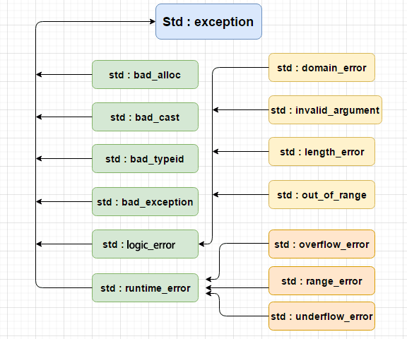

# 记录一些CPP中的关键字

## noexcept

noexcept是C++11引入的关键字，用于指定函数是否会抛出异常。它有两种用途：作为**说明符**（声明函数不会抛出异常）和作为**运算符**（检查表达式是否会抛出异常）。
基本用法如下：

```cpp
返回类型 函数名(参数列表) noexcept;  // 简单形式
返回类型 函数名(参数列表) noexcept(常量表达式);  // 条件形式
```

- 简单形式：表示函数不会抛出异常。
- 条件形式：根据常量表达式的结果来判断函数是否会抛出异常。

如果一个申明了noexcept的函数抛出了异常，程序会调用std::terminate()来终止程序。
同时，noexcept运算符可以用于检查表达式是否会抛出异常。基本用法如下：

```cpp
noexcept(表达式);
```

如果表达式会抛出异常，运算符返回false；否则返回true。示例：

```cpp
void pop() noexcept(noexcept(c.pop_back())) /* strengthened */ {
    c.pop_back();
}
```

## explicit

explicit用来修饰只有一个参数的类构造函数，以表明该构造函数是显式的，而非隐式的。当使用explicit修饰构造函数时，它将禁止类对象之间的隐式转换，以及禁止隐式调用拷贝构造函数。
对于一个对象：

```cpp
class Date
{
public:
    // 构造函数
    Date(int year):_year(year){}
private:
    int _year;
    int _month = 3;
    int _day = 31;
};
```

那么我们想创建对象可以通过`Date d(2023);`来调用构造函数
但是通过`Date d = 2023;`同样可以调用构造函数。原因就是因为有隐式类型转化的构造函数。
隐式类型转换(`int i = 1;double d = i;`)：对于类型转换而言，这里并不是将值直接赋值给到左边的对象，而是在中间呢会产生一个临时变量，例如右边的这个 i 会先去构造一个临时变量，这个临时变量的类型是 [double] 。把它里面的值初始化为 1，然后再通过这个临时对象进行拷贝构造给d，这就是编译器会做的一件事。

那么对于对象的构造也是一样的，2023会先去构造一个临时对象，这个临时对象的类型是 Date 。把它里面的值初始化为 2023，然后再通过这个临时对象进行拷贝构造给d。
那么引入explicit关键字，就可以禁止这种隐式类型转换的构造函数。示例：

```cpp
class Date
{
public:
    // 构造函数
    explicit Date(int year):_year(year){}
private:
    int _year;
    int _month = 3;
    int _day = 31;
};
```

如果再使用`Date d = 2023;`就会报错，因为explicit禁止了隐式类型转换的构造函数。

## using和typename

`using _Nodeptr = typename _Val_types::_Nodeptr;`用于定义类型别名的代码，其核心作用是为某个嵌套类型创建一个更简洁的别名，方便后续代码使用。

using 在这里用于定义类型别名，语法为`using 别名 = 原类型;`，功能类似于 typedef：`typedef 原类型名 新名称`，但在模板场景中更灵活。例如：`using IntPtr = int*;`表示IntPtr是`int*`的别名，后续可以用IntPtr代替`int*`。

```cpp
using IntPtr = int*;
int a = 10;
IntPtr p = &a;
```

typename 用于**告诉编译器后面的标识符是一个类型，而不是变量或函数名**。它通常用于模板中，尤其是当类型依赖于模板参数时。例如：`typename T::value_type`表示T的嵌套类型value_type。

```cpp
template <typename T>
void func(T t)
{
    typename T::value_type val;
    val = t.begin();
}
```

## C++异常处理

异常是程序在执行期间产生的问题。

- throw: 满足问题发生条件，程序会抛出一个异常。
- catch: 在可能发生异常的地方，通过异常处理程序捕获异常。
- try: try 块中的代码标识将被激活的特定异常。它后面通常跟着一个或多个 catch 块。

如果有一个块抛出一个异常，捕获异常的方法会使用 try 和 catch 关键字。try 块中放置可能抛出异常的代码，try 块中的代码被称为保护代码。使用 try/catch 语句的语法如下所示：

```cpp
try
{
   // 保护代码
}catch( ExceptionName e1 )
{
   // catch 块
}catch( ExceptionName e2 )
{
   // catch 块
}catch( ExceptionName eN )
{
   // catch 块
}
```

可以使用 throw 语句在代码块中的任何地方抛出异常。throw 语句的操作数可以是任意的表达式，表达式的结果的类型决定了抛出的异常的类型。


| 异常类型 | 描述|
| ------- |  --- |
|std::exception|该异常是所有标准 C++ 异常的父类。|
|std::bad_alloc|该异常可以通过 new 抛出。|
|std::bad_cast|该异常可以通过 dynamic_cast 抛出。|
|std::bad_typeid|该异常可以通过 typeid 抛出。|
|std::bad_exception|这在处理 C++ 程序中无法预期的异常时非常有用。|
|std::logic_error|理论上可以通过读取代码来检测到的异常。|
|std::domain_error|当使用了一个无效的数学域时，会抛出该异常。|
|std::invalid_argument|当使用了无效的参数时，会抛出该异常。|
|std::length_error |当创建了太长的 std::string 时，会抛出该异常。|
|std::out_of_range |该异常可以通过方法抛出，例如 std::vector 和 `std::bitset<>::operator[]()`|
|std::runtime_error|理论上不可以通过读取代码来检测到的异常。|
|std::overflow_error|当发生数学上溢时，会抛出该异常。|
|std::range_error|当尝试存储超出范围的值时，会抛出该异常。|
|std::underflow_error|当发生数学下溢时，会抛出该异常。|

## pair

pair 是一个很实用的"小玩意"，当想要将两个元素绑在一起作为一个合成元素、又不想要因此定义结构体时，使用 pair 可以很方便地作为一个代替品。pair 实际上可以看作一个内部有两个元素的结构体，且这两个元素的类型是可以指定的。

```cpp
template <class _Ty1,class _Ty2>
struct pair{
    _Ty1 first;
    _Ty2 second;
}
```

若想构建一个 pair 对象，需要指定两个元素的类型，例如：`pair<int, string> p(1, "hello");`表示构建一个 pair 对象，第一个元素是 int 类型的 1，第二个元素是 string 类型的 "hello"。
pair 的两个元素可以通过成员变量 first 和 second 进行访问，例如：`p.first` 访问第一个元素，`p.second` 访问第二个元素。同时也可以同make_pair函数进行赋值，例如：`p = make_pair(2, "world");`

```cpp
pair<int, string> p(1, "hello");
cout << p.first << endl;  // 1
cout << p.second << endl;  // hello
p = make_pair(2, "world");
cout << p.first << endl;  // 2
cout << p.second << endl;  // world
```

## 无穷大 灵茶山艾府

在编程中，0x3f3f3f3f是一个经典的 “伪无穷大” 常量，常被用来表示算法中的 “无穷大（inf）”。设计它主要有以下几个关键点：

1. 0x3f3f3f3f是一个 32 位十六进制整数，转换为十进制后的值为 1061109567，这个值非常接近 10 亿（足够大）
2. 这个值远小于int的最大值（21 亿），不会超出int的表示范围，并且两个这样的数相加（10.6 亿 × 2 = 21.2 亿）仍小于int的最大值（21.47 亿），不会发生溢出
3. 每个字节都是0x3f（即二进制00111111）memset是按字节填充的，因此用0x3f作为填充值时，4 字节的int会被填充为0x3f3f3f3f，比逐个赋值更高效。

## C++ 模版

提到C++的泛型编程，不得不提到C++ 模版(template)。模板是泛型编程的基础，泛型编程即以一种独立于任何特定类型的方式编写代码。参考[菜鸟教程](https://www.runoob.com/cplusplus/cpp-templates.html).
模板是创建**泛型类或函数**的蓝图或公式。我们可以使用模板来定义函数和类，接下来让我们一起来看看如何使用。

### 函数模版

```cpp
template <typename type> 
ret-type func-name(parameter list)
{
   // 函数的主体
}
```

在这里，type 是函数所使用的数据类型的占位符名称。这个名称可以在函数定义中使用。

### 类模版

```cpp
template <class type> 
class class-name {

    // 类主体
    // 例如
    vector<type> elems;
}
```

在这里，type 是占位符类型名称，可以在类被实例化的时候进行指定。

## std::make_sharead 和 shared_ptr指针

std::shared_ptr是一个智能指针，解决了传统指针在进行内存管理时，经常面临到的两个主要问题：内存泄漏和二次释放。核心思想是共享所有权，通过引用计数机制来实现自动化内存管理。
多个std::shared_ptr可以共同指向堆上的一个对象，每个指针都拥有该对象的一份所有权。同时该指针内部共同维持着一个控制块，该控制块包含着两个计数：强引用计数(Strong Count)记录当前有多少个 std::shared_ptr实例正在指向这个对象。弱引用计数(Weak Count)记录当前有多少个 std::shared_ptr 的辅助指针 std::weak_ptr 正在观察这个对象。只有当强引用计数归零的时候，shared_ptr会自动调用该对象的析构函数。

`std::make_shared` 是 C++ 11 标准库中提供的一个智能指针辅助函数。主要作用是在一次内存分配中，同时为对象本身和 `std::shared_ptr`分配内存

`std::shared_ptr<T> ptr = std::make_shared<T>()`等价于`std::shared_ptr<T> ptr(new T())`

## Lambda表达式

```cpp
[capture](parameter_list) mutable -> return_type {
    function_body
};
```

参数定义如下：

- capture：捕获外部变量的方式
- parameter_list：参数列表（函数输入参数）
- mutable：是否允许修改捕获的值
- return_type：返回值的类型
- function_body：函数体

使用实例：

```cpp
vector<int> v = {3, 1, 4, 1, 5};

int base = 2;

sort(v.begin(), v.end(), 
    [base](int a, int b) {
        return (a % base) < (b % base);
});

for (int x : v) cout << x << " ";
```