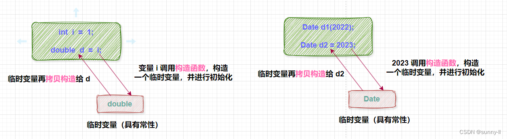

# 记录一些CPP中的关键字

## noexcept

noexcept是C++11引入的关键字，用于指定函数是否会抛出异常。它有两种用途：作为**说明符**（声明函数不会抛出异常）和作为**运算符**（检查表达式是否会抛出异常）。
基本用法如下：

```cpp
返回类型 函数名(参数列表) noexcept;  // 简单形式
返回类型 函数名(参数列表) noexcept(常量表达式);  // 条件形式
```

- 简单形式：表示函数不会抛出异常。
- 条件形式：根据常量表达式的结果来判断函数是否会抛出异常。

如果一个申明了noexcept的函数抛出了异常，程序会调用std::terminate()来终止程序。
同时，noexcept运算符可以用于检查表达式是否会抛出异常。基本用法如下：

```cpp
noexcept(表达式);
```

如果表达式会抛出异常，运算符返回false；否则返回true。示例：

```cpp
void pop() noexcept(noexcept(c.pop_back())) /* strengthened */ {
    c.pop_back();
}
```

## explicit

explicit用来修饰只有一个参数的类构造函数，以表明该构造函数是显式的，而非隐式的。当使用explicit修饰构造函数时，它将禁止类对象之间的隐式转换，以及禁止隐式调用拷贝构造函数。
对于一个对象：

```cpp
class Date
{
public:
    // 构造函数
    Date(int year):_year(year){}
private:
    int _year;
    int _month = 3;
    int _day = 31;
};
```

那么我们想创建对象可以通过`Date d(2023);`来调用构造函数
但是通过`Date d = 2023;`同样可以调用构造函数。原因就是因为有隐式类型转化的构造函数。
隐式类型转换(`int i = 1;double d = i;`)：对于类型转换而言，这里并不是将值直接赋值给到左边的对象，而是在中间呢会产生一个临时变量，例如右边的这个 i 会先去构造一个临时变量，这个临时变量的类型是 [double] 。把它里面的值初始化为 1，然后再通过这个临时对象进行拷贝构造给d，这就是编译器会做的一件事。

那么对于对象的构造也是一样的，2023会先去构造一个临时对象，这个临时对象的类型是 Date 。把它里面的值初始化为 2023，然后再通过这个临时对象进行拷贝构造给d。
那么引入explicit关键字，就可以禁止这种隐式类型转换的构造函数。示例：

```cpp
class Date
{
public:
    // 构造函数
    explicit Date(int year):_year(year){}
private:
    int _year;
    int _month = 3;
    int _day = 31;
};
```

如果再使用`Date d = 2023;`就会报错，因为explicit禁止了隐式类型转换的构造函数。

## using和typename

`using _Nodeptr = typename _Val_types::_Nodeptr;`用于定义类型别名的代码，其核心作用是为某个嵌套类型创建一个更简洁的别名，方便后续代码使用。

using 在这里用于定义类型别名，语法为`using 别名 = 原类型;`，功能类似于 typedef，但在模板场景中更灵活。例如：`using IntPtr = int*;`表示IntPtr是`int*`的别名，后续可以用IntPtr代替`int*`。

```cpp
using IntPtr = int*;
int a = 10;
IntPtr p = &a;
```

typename 用于告诉编译器后面的标识符是一个类型，而不是变量或函数名。它通常用于模板中，尤其是当类型依赖于模板参数时。例如：`typename T::value_type`表示T的嵌套类型value_type。

```cpp
template <typename T>
void func(T t)
{
    typename T::value_type val;
    val = t.begin();
}
```
